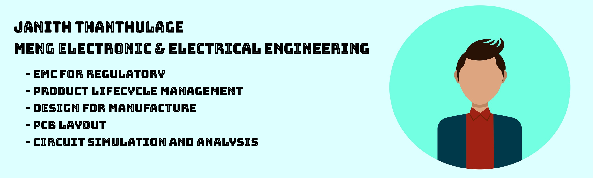

👋🏽 Hi, I’m Janith  👦🏽⚡  
---

I currently work as a Product Engineer in the Biotechnology sector with an emphasis on the lifecycle management of electronic components within the electrical cabinets of machinery.  

I am passionate about furthering my understanding of best practices wrt electronic and electrical design and use this github as a respository for active and past projects in addition to a general record of reading material/ notes which I've collected on the way.  

<!---
JanThan/JanThan is a ✨ special ✨ repository because its `README.md` (this file) appears on your GitHub profile.
You can click the Preview link to take a look at your changes.
--->
